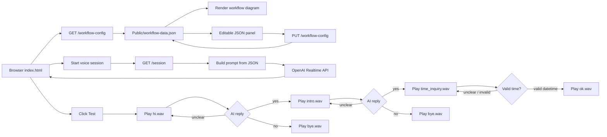

# Voice Workflow Test App

This test app is a browser-based voice workflow prototype. It connects the browser to the OpenAI Realtime API through WebRTC, plays local dialogue WAV files, classifies user replies, and lets you edit the workflow from the HTML page through one JSON configuration file.

## Purpose

The project is used to test an automated customer service call flow.

It supports:

- Realtime voice input through the browser microphone.
- AI response/classification through OpenAI Realtime.
- Local WAV playback for scripted dialogue steps.
- Phone dial and hangup through `EZUCPhoneAPI.js`.
- Editable workflow, prompt, model, voice, customer, and routing data through `Public/workflow-data.json`.
- A visual workflow diagram in `Public/index.html`.
- A JSON editor in the HTML page that can save changes back to `workflow-data.json`.

## How To Use

Install dependencies:

```powershell
cd test
npm install
```

Set the OpenAI API key:

```powershell
$env:OPENAI_API_KEY="your_api_key_here"
```

Start the Express backend:

```powershell
node server.js
```

Open the app:

```text
http://localhost:3000/
```

Use the page:

1. Select audio input/output devices if needed.
2. Click `Start` to start a normal Realtime voice session.
3. Click `Test` to run the scripted workflow.
4. Edit the JSON in the `Editable JSON` panel.
5. Click `Save JSON` to write changes into `Public/workflow-data.json`.
6. Click `Reload JSON` to discard unsaved page edits and reload from disk.

Important: saving JSON only works through the Express backend at `http://localhost:3000/`. If you open the HTML with file explorer or live-server, the workflow can load in read-only mode, but it cannot save back to disk.

## Functions

### Backend: `server.js`

- `readWorkflowConfig()`: reads `Public/workflow-data.json`.
- `writeWorkflowConfig(config)`: writes edited JSON back to `Public/workflow-data.json`.
- `getAssistantConfig()`: returns the `assistant` section from the JSON file.
- `getCustomerConfig()`: returns `assistant.customer`.
- `renderPromptLine(line, variables)`: replaces placeholders such as `{{customer.Company}}` and `{{localNow}}`.
- `buildPromptFromConfig(mode)`: builds the active instruction prompt from JSON.
- `getMode(req)`: validates the requested mode, such as `default`, `test`, or `time`.
- `buildInstructionPrompt(mode)`: combines the mode prompt with conversation history.
- `GET /workflow-config`: sends the current JSON config to the browser.
- `PUT /workflow-config`: saves edited JSON from the browser.
- `GET /session`: creates an OpenAI Realtime client secret.
- `GET /instruction`: returns the current rendered instruction prompt.
- `POST /conversation`: stores conversation messages in memory.
- `DELETE /conversation`: clears conversation history.
- `POST /call`: dials the phone number from JSON.
- `POST /hangup`: hangs up the phone call.

### Frontend: `Public/index.html`

- Main voice UI.
- Conversation panel.
- Latest AI reply panel.
- Console log panel.
- Audio device selectors.
- Prompt display.
- Workflow diagram.
- Editable JSON panel.

### Frontend: `Public/workflow-diagram.js`

- Loads config from `/workflow-config`.
- Falls back to `workflow-data.json` in read-only mode.
- Renders workflow nodes and edges.
- Generates Mermaid-style source.
- Switches workflow display language.
- Saves edited JSON through `PUT /workflow-config`.
- Dispatches `voai:workflow-config-updated` after saving.

### Frontend: `Public/TestDialogueFlow.js`

- Loads runtime flow from `/workflow-config`.
- Starts the test workflow when `Test` is clicked.
- Plays WAV files from `DIALOGUE`.
- Sends system history into the Realtime prompt.
- Handles `yes`, `no`, `unclear`, and appointment-time replies.
- Saves parsed appointment data into `window.voaiScheduledTimes`.
- Plays `/DIALOGUE/ok.wav` when a valid appointment time is received.

### Frontend: `Public/LanguageSelection.js`

- Controls UI language text for the main demo page.

### Frontend: `Public/CallBtn.js`

- Connects Call and End Call buttons to backend phone endpoints.

### Config: `Public/workflow-data.json`

This is the main editable data source.

It contains:

- `assistant.model`
- `assistant.transcriptionModel`
- `assistant.timezone`
- `assistant.textOnlyModes`
- `assistant.customer`
- `assistant.prompts.default`
- `assistant.prompts.test`
- `assistant.prompts.time`
- workflow display languages
- workflow views
- workflow nodes
- workflow edges
- WAV file paths
- yes/no/unclear routing

## Code Explain

The backend does not hardcode the workflow prompt anymore. Instead, `server.js` reads `Public/workflow-data.json` every time it needs config data. This means edits saved from the HTML page can affect future sessions without changing JavaScript code.

The prompt system supports placeholders:

```text
Company: {{customer.Company}}
Today's local date and time is: {{localNow}}
```

When `/instruction` or `/session` is called, these placeholders are replaced with current JSON data and current local time.

The workflow test mode uses two instruction modes:

- `test`: classifies replies as `yes`, `no`, or `unclear`.
- `time`: extracts appointment time and returns:

```text
yyyy/mm/dd hh:mm | specified time
```

or:

```text
yyyy/mm/dd hh:mm | not specified time
```

The browser then parses that response. If the response is valid, it saves the time and plays `/DIALOGUE/ok.wav`. If the response is invalid or unclear, it replays the current WAV prompt.

The JSON editor works like this:

1. Browser calls `GET /workflow-config`.
2. JSON appears in the editor.
3. User edits JSON.
4. Browser calls `PUT /workflow-config`.
5. Server writes the JSON file.
6. Workflow diagram re-renders.
7. Test flow reloads the config for the next run.

## Flowchart



## Project Structure

```text
test/
  server.js
  main.js
  package.json
  EZUCPhoneAPI.js
  DIALOGUE/
    hi.wav
    intro.wav
    time_inquiry.wav
    bye.wav
    ok.wav
  Public/
    index.html
    workflow-data.json
    workflow-diagram.js
    workflow.css
    TestDialogueFlow.js
    LanguageSelection.js
    CallBtn.js
```

## Troubleshooting

### `Failed to load workflow config: HTTP 404`

You are not using the updated Express server, or the server was not restarted.

Fix:

```powershell
cd test
node server.js
```

Then open:

```text
http://localhost:3000/
```

### JSON saves do not work

Saving only works through `node server.js`. Static servers cannot write files.

### OpenAI session fails

Check that `OPENAI_API_KEY` is set in the same terminal where `node server.js` is running.

### Test flow replays time prompt

The AI reply did not match the expected time format. The expected format is:

```text
yyyy/mm/dd hh:mm | specified time
yyyy/mm/dd hh:mm | not specified time
```
